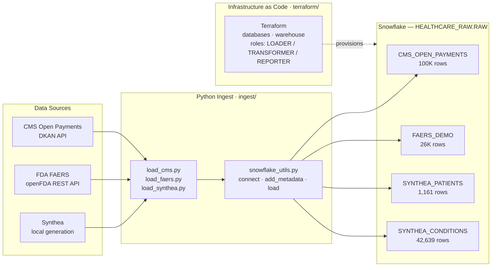
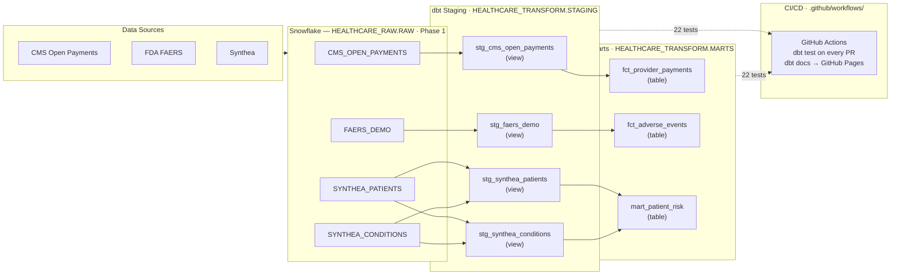

# Architecture

This diagram is updated at the end of each phase to show the cumulative state of the platform.

---

## Phase 1 — Snowflake Foundation + Raw Ingest

**Roles provisioned by Terraform:**

| Role | Permissions |
|---|---|
| `LOADER` | Write to `HEALTHCARE_RAW` |
| `TRANSFORMER` | Read RAW, write `HEALTHCARE_TRANSFORM` |
| `REPORTER` | SELECT-only on marts |

All ingest runs are **idempotent** — each script truncates before loading so re-runs produce the same table state.

---

---

## Phase 2 — dbt Transformations + CI/CD

**dbt model summary:**

| Layer | Models | Materialization | Tests |
|---|---|---|---|
| Staging | 4 | View | 6 (not_null, unique, relationships) |
| Marts | 3 | Table | 16 (not_null, unique, accepted_values) |

**Key mart features for downstream phases:**

- `mart_patient_risk.risk_tier` — high/medium/low stratification, drives Phase 4 ML cohort selection
- `mart_patient_risk.comorbidity_score` — active condition count, seed feature for Phase 4 Feature Store
- `mart_patient_risk.polypharmacy_flag` — proxy flag (≥5 active conditions); replaced with medication count in Phase 4
