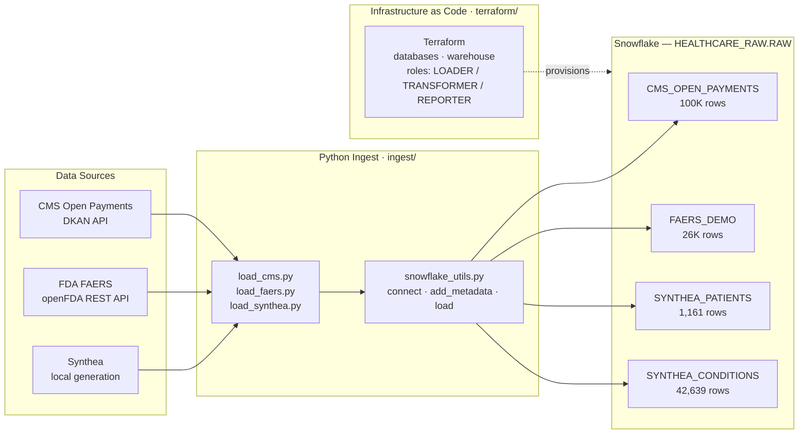

# Architecture

This diagram is updated at the end of each phase to show the cumulative state of the platform.

---

## Phase 1 — Snowflake Foundation + Raw Ingest

**Roles provisioned by Terraform:**

| Role | Permissions |
|---|---|
| `LOADER` | Write to `HEALTHCARE_RAW` |
| `TRANSFORMER` | Read RAW, write `HEALTHCARE_TRANSFORM` |
| `REPORTER` | SELECT-only on marts |

All ingest runs are **idempotent** — each script truncates before loading so re-runs produce the same table state.

---

*Phase 2 will add: dbt staging → mart layer + GitHub Actions CI/CD*
