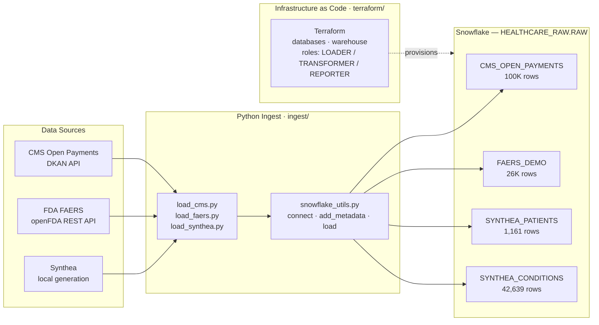
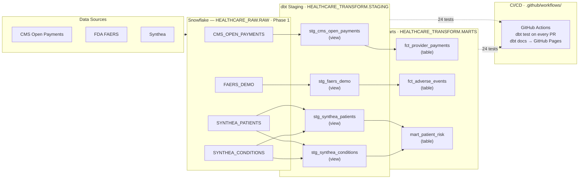
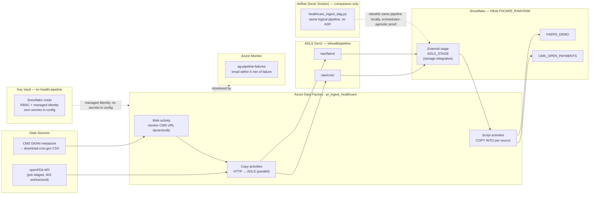
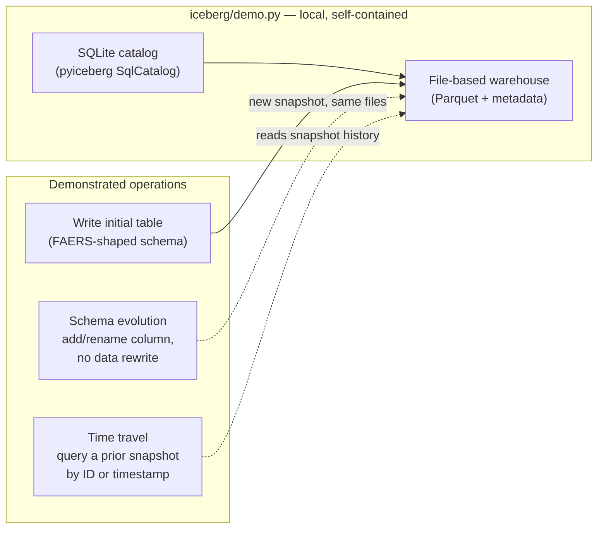
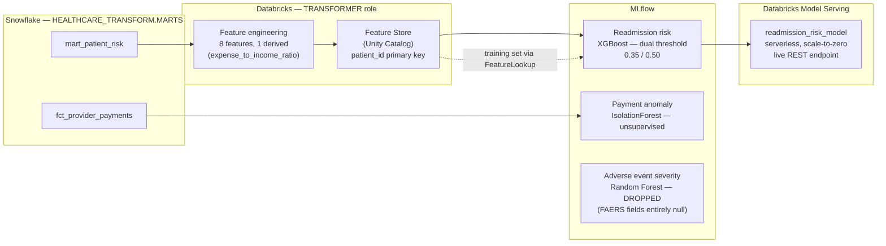
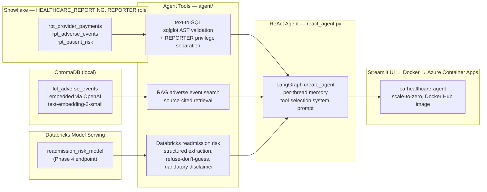

# Architecture

This diagram is updated at the end of each phase to show the cumulative state of the platform.

---

## Phase 1 — Snowflake Foundation + Raw Ingest

```mermaid
flowchart LR
    subgraph sources["Data Sources"]
        cms["CMS Open Payments\nDKAN API"]
        faers["FDA FAERS\nopenFDA REST API"]
        synthea["Synthea\nlocal generation"]
    end

    subgraph ingest["Python Ingest  ·  ingest/"]
        scripts["load_cms.py\nload_faers.py\nload_synthea.py"]
        utils["snowflake_utils.py\nconnect · add_metadata · load"]
    end

    subgraph sf["Snowflake — HEALTHCARE_RAW.RAW"]
        direction TB
        t1["CMS_OPEN_PAYMENTS\n100K rows"]
        t2["FAERS_DEMO\n26K rows"]
        t3["SYNTHEA_PATIENTS\n1,161 rows"]
        t4["SYNTHEA_CONDITIONS\n42,639 rows"]
    end

    subgraph iac["Infrastructure as Code  ·  terraform/"]
        tf["Terraform\ndatabases · warehouse\nroles: LOADER / TRANSFORMER / REPORTER"]
    end

    cms     --> scripts
    faers   --> scripts
    synthea --> scripts
    scripts --> utils
    utils   --> t1 & t2 & t3 & t4
    tf      -. "provisions" .-> sf
```

**Roles provisioned by Terraform:**

| Role | Permissions |
|---|---|
| `LOADER` | Write to `HEALTHCARE_RAW` |
| `TRANSFORMER` | Read RAW, write `HEALTHCARE_TRANSFORM` |
| `REPORTER` | SELECT-only on marts |

All ingest runs are **idempotent** — each script truncates before loading so re-runs produce the same table state.

---

---

## Phase 2 — dbt Transformations + CI/CD

```mermaid
flowchart LR
    subgraph sources["Data Sources"]
        cms["CMS Open Payments"]
        faers["FDA FAERS"]
        synthea["Synthea"]
    end

    subgraph raw["Snowflake — HEALTHCARE_RAW.RAW  ·  Phase 1"]
        t1["CMS_OPEN_PAYMENTS"]
        t2["FAERS_DEMO"]
        t3["SYNTHEA_PATIENTS"]
        t4["SYNTHEA_CONDITIONS"]
    end

    subgraph dbt_stg["dbt Staging  ·  HEALTHCARE_TRANSFORM.STAGING"]
        s1["stg_cms_open_payments\n(view)"]
        s2["stg_faers_demo\n(view)"]
        s3["stg_synthea_patients\n(view)"]
        s4["stg_synthea_conditions\n(view)"]
    end

    subgraph dbt_mart["dbt Marts  ·  HEALTHCARE_TRANSFORM.MARTS"]
        m1["fct_provider_payments\n(table)"]
        m2["fct_adverse_events\n(table)"]
        m3["mart_patient_risk\n(table)"]
    end

    subgraph cicd["CI/CD  ·  .github/workflows/"]
        gh["GitHub Actions\ndbt test on every PR\ndbt docs → GitHub Pages"]
    end

    sources --> raw
    t1 --> s1
    t2 --> s2
    t3 & t4 --> s3 & s4
    s1 --> m1
    s2 --> m2
    s3 & s4 --> m3
    dbt_stg & dbt_mart -. "24 tests" .-> gh
```

**dbt model summary:**

| Layer | Models | Materialization | Tests |
|---|---|---|---|
| Staging | 4 | View | 6 (not_null, unique, relationships) |
| Marts | 3 | Table | 16 (not_null, unique, accepted_values) |

**Key mart features for downstream phases:**

- `mart_patient_risk.risk_tier` — high/medium/low stratification, drives Phase 4 ML cohort selection
- `mart_patient_risk.comorbidity_score` — active condition count, seed feature for Phase 4 Feature Store
- `mart_patient_risk.polypharmacy_flag` — proxy flag (≥5 active conditions); replaced with medication count in Phase 4

---

## Phase 3 — Azure Orchestration + Airflow Comparison

```mermaid
flowchart LR
    subgraph sources["Data Sources"]
        cms["CMS DKAN metastore\n→ download.cms.gov CSV"]
        faers["openFDA API\n(pre-staged, 403 workaround)"]
    end

    subgraph adf["Azure Data Factory  ·  pl_ingest_healthcare"]
        web["Web activity\nresolve CMS URL dynamically"]
        copy["Copy activities\nHTTP → ADLS (parallel)"]
        script["Script activities\nCOPY INTO per source"]
    end

    subgraph adls["ADLS Gen2 — sthealthpipeline"]
        raw_cms["raw/cms/"]
        raw_faers["raw/faers/"]
    end

    subgraph kv["Key Vault — kv-health-pipeline"]
        secrets["Snowflake creds\nRBAC + managed identity\nzero secrets in config"]
    end

    subgraph sf["Snowflake — HEALTHCARE_RAW.RAW"]
        stage["External stage\nADLS_STAGE\n(storage integration)"]
        t1["CMS_OPEN_PAYMENTS"]
        t2["FAERS_DEMO"]
    end

    subgraph af["Airflow (local, Docker) — comparison only"]
        dag["healthcare_ingest_dag.py\nsame logical pipeline, no ADF"]
    end

    subgraph mon["Azure Monitor"]
        alert["ag-pipeline-failures\nemail within 5 min of failure"]
    end

    cms   --> web --> copy
    faers --> copy
    copy  --> raw_cms & raw_faers
    kv -. "managed identity, no secrets in config" .-> adf
    raw_cms & raw_faers --> stage
    stage --> script --> t1 & t2
    adf -. "monitored by" .-> mon
    dag -. "rebuilds same pipeline locally, orchestrator-agnostic proof" .-> stage
```

**Why this matters:** the external stage decouples the load from the orchestrator —
Snowflake reads directly from ADLS rather than ADF transferring the data twice.
Airflow rebuilds the identical logical pipeline locally to demonstrate the
ingestion logic isn't tied to one orchestrator — a deliberate comparison
exercise, not a second production system. Tradeoffs documented in
[azure/README.md](../azure/README.md).

---

## Phase 3.5 — Apache Iceberg Exploration

```mermaid
flowchart LR
    subgraph demo["iceberg/demo.py — local, self-contained"]
        direction TB
        catalog["SQLite catalog\n(pyiceberg SqlCatalog)"]
        wh["File-based warehouse\n(Parquet + metadata)"]
    end

    subgraph ops["Demonstrated operations"]
        s1["Write initial table\n(FAERS-shaped schema)"]
        s2["Schema evolution\nadd/rename column,\nno data rewrite"]
        s3["Time travel\nquery a prior snapshot\nby ID or timestamp"]
    end

    catalog --> wh
    s1 --> wh
    s2 -. "new snapshot, same files" .-> wh
    s3 -. "reads snapshot history" .-> wh
```

**Point of view:** Iceberg is a table format layer (catalog + snapshot tree)
over plain files — it gives Parquet/Hive database-like guarantees (schema
evolution without rewrites, time travel, safe concurrent writes) without a
warehouse engine underneath. This is a standalone learning exploration, run
entirely locally with no Snowflake dependency — **not** a claim of hands-on
production experience, and not a replacement for the Snowflake warehouse.
Snowflake can read external Iceberg tables directly, which is the integration
point worth knowing if a team already has an Iceberg lake. Full writeup:
[docs/iceberg_notes.md](iceberg_notes.md).

---

## Phase 4 — Databricks + MLflow

```mermaid
flowchart LR
    subgraph sf["Snowflake — HEALTHCARE_TRANSFORM.MARTS"]
        m1["mart_patient_risk"]
        m3["fct_provider_payments"]
    end

    subgraph db["Databricks — TRANSFORMER role"]
        direction TB
        fe["Feature engineering\n8 features, 1 derived\n(expense_to_income_ratio)"]
        fs["Feature Store\n(Unity Catalog)\npatient_id primary key"]
    end

    subgraph mlflow["MLflow"]
        exp1["Readmission risk\nXGBoost — dual threshold\n0.35 / 0.50"]
        exp3["Payment anomaly\nIsolationForest — unsupervised"]
        dropped["Adverse event severity\nRandom Forest — DROPPED\n(FAERS fields entirely null)"]
    end

    subgraph serve["Databricks Model Serving"]
        endpoint["readmission_risk_model\nserverless, scale-to-zero\nlive REST endpoint"]
    end

    m1 --> fe --> fs --> exp1
    m3 --> exp3
    fs -. "training set via FeatureLookup" .-> exp1
    exp1 --> endpoint
```

**Why this matters:** features come from the same governed dbt mart the
business already relies on — training/serving skew is eliminated at the
source, not patched after the fact. The dropped third model is documented
with its cause and revival path rather than quietly removed. Full model
cards: [docs/model_cards.md](model_cards.md).

---

## Phase 5 — RAG Agent + Streamlit UI

```mermaid
flowchart LR
    subgraph sf["Snowflake — HEALTHCARE_REPORTING, REPORTER role"]
        views["rpt_provider_payments\nrpt_adverse_events\nrpt_patient_risk"]
    end

    subgraph chroma["ChromaDB (local)"]
        vec["fct_adverse_events\nembedded via OpenAI\ntext-embedding-3-small"]
    end

    subgraph db["Databricks Model Serving"]
        risk["readmission_risk_model\n(Phase 4 endpoint)"]
    end

    subgraph tools["Agent Tools — agent/"]
        t1["text-to-SQL\nsqlglot AST validation\n+ REPORTER privilege separation"]
        t2["RAG adverse event search\nsource-cited retrieval"]
        t3["Databricks readmission risk\nstructured extraction,\nrefuse-don't-guess,\nmandatory disclaimer"]
    end

    subgraph agent["ReAct Agent — react_agent.py"]
        core["LangGraph create_agent\nper-thread memory\ntool-selection system prompt"]
    end

    subgraph ui["Streamlit UI → Docker → Azure Container Apps"]
        app["ca-healthcare-agent\nscale-to-zero, Docker Hub image"]
    end

    views --> t1
    vec   --> t2
    risk  --> t3
    t1 & t2 & t3 --> core --> app
```

**Why this matters:** two independent guardrail layers on the SQL tool
(privilege separation + AST validation, not keyword matching), a
refuse-don't-guess pattern on the clinical risk tool with a mandatory
disclaimer on every response, and a manual 10-question evaluation (8/10,
two honest misses with scoped fixes) — see
[docs/evaluation.md](evaluation.md). Live demo:
https://ca-healthcare-agent.victoriousmeadow-ffdf677d.eastus.azurecontainerapps.io
